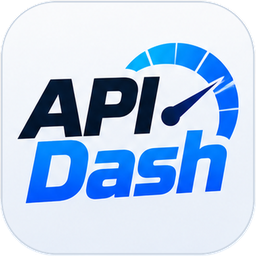

# API Dash

A Windows app that runs betting dashboards for **stake.us**, **stake.com** and
**nuts.gg**. It places bets far faster than you can click, and stops exactly
where you tell it to.

### [Download the latest version →](../../releases/latest)

One file, `ApiDash.exe`, about 134 MB. Nothing to install.

---

## You need a key

The app is licensed per person. Ask for one and you will get a key that looks
like `SD-XXXXX-XXXXX-XXXXX-XXXXX`, along with how long it lasts and which sites
it covers.

> **Contact:** _add your contact here before sharing this page_

A key is claimed by the first machine that uses it and is tied to that machine
afterwards. Moving to a new PC is fine — ask and it will be unbound.

## First run, in order

1. **Windows will say "Windows protected your PC."** The app is not
   code-signed, so Windows does not recognise it. Click **More info**, then
   **Run anyway**. If that sentence bothers you, do not run it — that is a
   reasonable thing to decide.
2. Paste your key.
3. Open a site and **log in inside the app**. It keeps its own browser and its
   own login; your normal browser's session is not used and not read.
4. The dashboard appears as a small button in the corner. Click it.

On the very first open you get a short walkthrough. You can bring it back any
time with the **?** button in the panel header.

## What it does

- **Every game takes conditions**, not just dice — mines, plinko, keno, tower,
  limbo, roulette, and the rest.
- **Conditions**: when a streak, a profit level, a multiplier or a bet count
  happens, change the stake, change the game's settings, switch sides, or stop.
  Give one a colour and a sound and you can see and hear which rule owned a bet.
- **Stops**: max loss, max bets, drawdown, take profit, target balance,
  minimum balance.
- **Simulated mode** plays the real games against a fake balance and sends
  nothing to the site. Use it first.
- A bet log, live statistics and an equity graph for every run.

## Requirements

- Windows 10 or 11, 64-bit.
- The WebView2 runtime, which is already part of Windows 11 and most Windows 10
  installs. If the app will not start, install Microsoft's
  **Evergreen WebView2 Runtime** and try again.
- **stake.us needs a VPN in some regions.** It has to be a *system* VPN — the
  app has its own browser and cannot see your browser's VPN extension.

## Read this before you use it

- **It bets real money.** Sweeps Coins are redeemable and every stake.com
  currency is withdrawable. A simulated run is the only run that stakes nothing.
- **Automated play is against Stake's terms** — clause 8.2(c) of the stake.us
  terms — and an account caught using it can be closed with its balance
  withheld. That risk is yours.
- **No strategy beats the house edge.** Betting faster only loses faster. This
  tool does not change the odds of anything; it changes how quickly and how
  precisely you can act on them.
- **No warranty of any kind.** The sites can change their APIs at any time. The
  app checks what it can and stops when it sees something it does not
  understand, but it comes with no guarantee.
- Gambling is for adults only, at whatever age your jurisdiction sets, and only
  with money you can afford to lose.

---

All rights reserved. The dashboards themselves are not distributed here — the
app fetches them at run time against your key.
